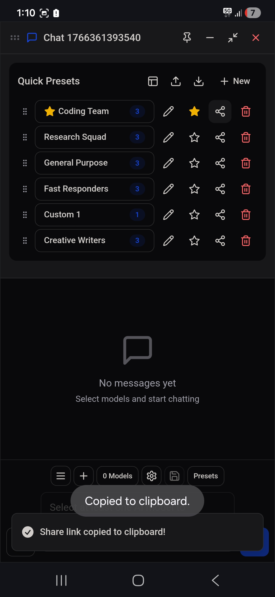
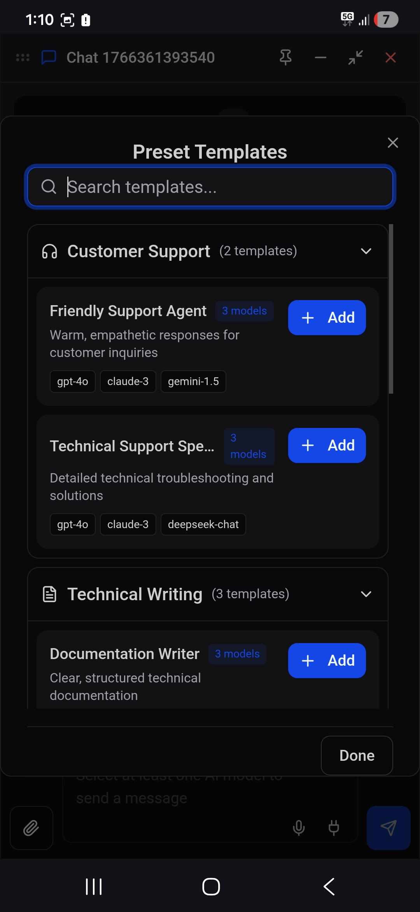

# Multi-AI Chat - Reference Version Documentation

**Version:** 9a8be4ee  
**Date:** December 22, 2025  
**Status:** Working / Stable

---

## Overview

This document serves as the Reference Version for the Multi-AI Chat application. Use this as a baseline for future development and troubleshooting.

---

## Quick Presets Feature

### Quick Presets Panel

The Quick Presets panel is accessible via the "Presets" button in the chat footer. It displays a list of user's favorite presets for quick access.

**Key Features:**
- Drag-and-drop reordering (grip handle on left)
- Inline editing (double-click preset name or click pencil icon)
- Remove button (trash icon) to remove presets from Quick Presets
- "+ New" button opens the Add Presets modal dialog
- **Favorite/Star button** - Mark presets as favorites (yellow star when active)
- **Share link button** - Copy shareable URL to clipboard
- **Usage analytics** - Displays usage count for each preset
- **Import/Export buttons** - Export presets to JSON or import from file
- **Browse templates button** - Access preset templates library

**UI Elements:**
- Header: "Quick Presets" title with toolbar icons (Browse templates, Import, Export, "+ New")
- Preset items: Drag handle | Preset button (name + model count + usage count) | Edit | Star | Share | Delete
- Model count displayed in blue pill badge
- Usage count displayed as "X uses" text
- Favorited presets show filled yellow star

### Add Presets Modal Dialog ("+ New" Button)

When clicking "+ New", a modal dialog opens with the following features:

**Modal Structure:**
1. **Header:** "Add Presets to Quick Presets" with close (X) button
2. **Search Input:** Search bar with magnifying glass icon, placeholder "Search presets..."
3. **Preset Categories:** Collapsible sections organized by type
4. **Create New Preset:** Link at bottom with plus icon
5. **Action Buttons:** "Cancel" and "Add X preset(s)" buttons

**Categories:**
- **Coding** - Contains coding-related presets (Coding Team)
- **Writing** - Contains writing-related presets (Creative Writers)
- **Research** - Contains research-related presets (Research Squad)
- **General** - Contains general-purpose presets (General Purpose, Fast Responders)
- **Custom Presets** - User-created custom presets

**Category Behavior:**
- Each category shows preset count: "(X preset)" or "(X presets)"
- Clicking category header expands/collapses the section
- Chevron icon indicates expanded (down) or collapsed (right) state
- Selected count badge appears when presets are selected: "X selected"

**Preset Selection:**
- Click preset to toggle selection
- Selected presets show checkmark (✓) and highlighted border
- Multiple presets can be selected across categories
- "Add X preset(s)" button appears when presets are selected

**Search Functionality:**
- Filters presets by name or model names
- Updates in real-time as user types
- Shows "No presets match your search" when no results
- Shows "All presets are already in Quick Presets" when all added

**Keyboard Navigation:**
- Arrow Up/Down to navigate between presets
- Space to toggle selection
- Enter to add selected presets
- Escape to close modal

---

## Preset Templates Feature

### Browse Templates Modal

Accessible via the grid icon (Browse templates) button in the Quick Presets header.

**Modal Structure:**
1. **Header:** "Preset Templates" with close (X) button
2. **Search Input:** Search bar with placeholder "Search templates..."
3. **Template Categories:** Collapsible sections with icons
4. **Template Cards:** Show name, model count, description, and models list
5. **Add Button:** "+ Add" button on each template card
6. **Done Button:** Close modal when finished

**Template Categories:**
| Category | Icon | Templates |
|----------|------|-----------|
| Customer Support | Headphones | Friendly Support Agent, Technical Support Specialist |
| Technical Writing | Document | Documentation Writer, API Reference Creator, Tutorial Author |
| Brainstorming | Lightbulb | Creative Ideation, Problem Solver |
| Analysis | BarChart | Data Analyst, Research Synthesizer |
| Development | Code | Full-Stack Developer, Code Reviewer, DevOps Engineer |

**Template Card Structure:**
- Template name (bold)
- Model count badge (e.g., "3 models")
- "+ Add" button (blue)
- Description text
- Model tags (e.g., "gpt-4o", "claude-3", "gemini-1.5")

---

## Usage Analytics Feature

### How It Works
- Each preset tracks how many times it has been applied
- Usage count is stored in localStorage under `presetUsageStats`
- Count increments when user clicks a preset to apply it
- Displayed as "X uses" text next to the preset

### Storage Format
```typescript
interface PresetUsageStats {
  [presetId: string]: number;
}
```

---

## URL Sharing Feature

### How It Works
1. Click the share link icon on any preset
2. A shareable URL is generated with preset data encoded in base64
3. URL is copied to clipboard
4. Toast notification confirms "Share link copied to clipboard!"

### URL Format
```
https://[domain]/?preset=[base64-encoded-preset-data]
```

### Import via URL
When visiting a URL with `?preset=` parameter:
1. Preset data is decoded from base64
2. User is prompted to add the preset
3. Preset is added to Quick Presets if confirmed

---

## File Structure

### Key Components

```
client/src/components/
├── FloatingChatWindow.tsx    # Main chat window with Quick Presets panel
├── PresetSelectionDialog.tsx # Add Presets modal dialog + Templates modal
├── PresetsPanel.tsx          # Standalone presets panel component
├── PresetEditorModal.tsx     # Create/edit preset modal
└── PresetsManagementModal.tsx # Full presets management
```

### State Management

**Quick Presets State (FloatingChatWindow.tsx):**
```typescript
const [quickPresets, setQuickPresets] = useState<QuickPreset[]>([]);
const [showPresetSelection, setShowPresetSelection] = useState(false);
```

**QuickPreset Type (lib/quick-presets.ts):**
```typescript
interface QuickPreset {
  id: string;
  sourceId: string;
  sourceType: 'built-in' | 'custom';
  name: string;
  models: string[];
  description?: string;
  isModified?: boolean;
  isFavorite?: boolean;
}
```

---

## Built-in Presets

Defined in `client/src/lib/ai-providers.ts`:

| Preset Key | Name | Models | Description |
|------------|------|--------|-------------|
| coding | Coding Team | GPT-4o, DeepSeek Coder, Codestral | Best models for programming and code review |
| creative | Creative Writers | Claude 3.5 Sonnet, GPT-4o, Gemini 1.5 Pro | Ideal for creative writing and storytelling |
| research | Research Squad | Perplexity, Claude 3.5 Sonnet, GPT-4o | Optimized for research and fact-finding |
| general | General Purpose | GPT-4o, Claude 3.5 Sonnet, Gemini 1.5 Pro | Balanced selection for everyday tasks |
| fast | Fast Responders | GPT-4o Mini, Claude 3 Haiku, Gemini 1.5 Flash | Quick responses for simple queries |

---

## Preset Templates

| Category | Template Name | Models | Description |
|----------|---------------|--------|-------------|
| Customer Support | Friendly Support Agent | gpt-4o, claude-3, gemini-1.5 | Warm, empathetic responses for customer inquiries |
| Customer Support | Technical Support Specialist | gpt-4o, claude-3, deepseek-chat | Detailed technical troubleshooting and solutions |
| Technical Writing | Documentation Writer | gpt-4o, claude-3, gemini-1.5 | Clear, structured technical documentation |
| Technical Writing | API Reference Creator | gpt-4o, deepseek-coder, codestral | Precise API documentation with examples |
| Technical Writing | Tutorial Author | claude-3, gpt-4o, gemini-1.5 | Step-by-step educational content |
| Brainstorming | Creative Ideation | claude-3, gpt-4o, gemini-1.5 | Generate innovative ideas and concepts |
| Brainstorming | Problem Solver | gpt-4o, claude-3, deepseek-chat | Analytical approach to complex problems |
| Analysis | Data Analyst | gpt-4o, claude-3, deepseek-chat | Data interpretation and insights |
| Analysis | Research Synthesizer | perplexity, claude-3, gpt-4o | Combine multiple sources into coherent analysis |
| Development | Full-Stack Developer | gpt-4o, deepseek-coder, codestral | End-to-end development assistance |
| Development | Code Reviewer | claude-3, gpt-4o, deepseek-coder | Thorough code review and suggestions |
| Development | DevOps Engineer | gpt-4o, deepseek-coder, claude-3 | Infrastructure and deployment expertise |

---

## localStorage Keys

| Key | Description |
|-----|-------------|
| `quickPresets` | Array of QuickPreset objects |
| `customPresets` | Array of user-created custom presets |
| `presetUsageStats` | Object mapping preset IDs to usage counts |

---

## Troubleshooting Guide

### Modal Not Opening
1. Check if `showPresetSelection` state is being set to `true`
2. Verify PresetSelectionDialog is rendered in component tree
3. Check for JavaScript errors in console

### Presets Not Showing in Categories
1. Verify `MODEL_PRESETS` is imported correctly
2. Check `PRESET_CATEGORIES` mapping in PresetSelectionDialog.tsx
3. Ensure presets aren't already in `quickPresets` (they get filtered out)

### Search Not Working
1. Check `searchQuery` state is updating
2. Verify `filteredPresets` useMemo dependency array
3. Ensure search matches preset name or model names

### Create New Preset Not Working
1. Verify `onCreateNew` prop is passed to PresetSelectionDialog
2. Check if PresetEditorModal is rendered
3. Ensure `showPresetEditor` state is being set

### Share Link Not Working
1. Check if clipboard API is available (requires HTTPS)
2. Verify preset data is being encoded correctly
3. Check browser console for errors

### Templates Not Loading
1. Verify PRESET_TEMPLATES constant is defined
2. Check if showTemplates state is toggling correctly
3. Ensure template categories are properly structured

---

## Screenshots Reference

### Quick Presets Panel (v2)


**Key Elements:**
- Header toolbar with: Browse templates (grid), Import (upload), Export (download), "+ New" button
- Preset items with: Drag handle | Name + model count | Edit (pencil) | Star (favorite) | Share (link) | Delete (trash)
- Favorited preset shows filled yellow star (Coding Team)
- Usage count displayed for presets with usage
- "Copied to clipboard" and "Share link copied to clipboard!" toast notifications shown
- Presets shown: Coding Team (favorited), Research Squad, General Purpose, Fast Responders, Custom 1, Creative Writers

### Preset Templates Modal


**Key Elements:**
- Modal title: "Preset Templates" with X close button
- Search input with placeholder "Search templates..."
- Collapsible categories with icons:
  - Customer Support (headphones icon) - 2 templates
  - Technical Writing (document icon) - 3 templates
- Template cards showing:
  - Template name (bold)
  - Model count badge (e.g., "3 models")
  - "+ Add" button (blue)
  - Description text
  - Model tags (gray pills)
- "Done" button at bottom

### Add Presets Modal


**Key Elements:**
- Modal title: "Add Presets to Quick Presets" with X close button
- Search input with magnifying glass icon
- Collapsible "Custom Presets" category showing "(1 preset)" and "1 selected" badge
- "Custom 1 (1 models)" preset with blue checkmark indicating selection
- "+ Create New Preset" link at bottom in blue
- "Cancel" button (outline) and "Add 1 preset" button (filled blue)

---

## Version History

| Version | Date | Changes |
|---------|------|---------|
| 779958d3 | Dec 22, 2025 | Implemented modal dialog with search, categories, and create new preset |
| ea6b90f0 | Dec 22, 2025 | Added Reference Version documentation with screenshots |
| 2032800a | Dec 22, 2025 | Added preset descriptions, favorites, import/export, JSDoc comments, 26 Vitest tests, keyboard navigation |
| 9a8be4ee | Dec 22, 2025 | **Added usage analytics, URL sharing, and preset templates (12 templates in 5 categories)** |

---

*This document should be updated whenever significant changes are made to the Quick Presets feature.*
