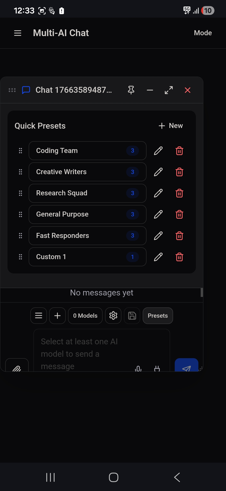
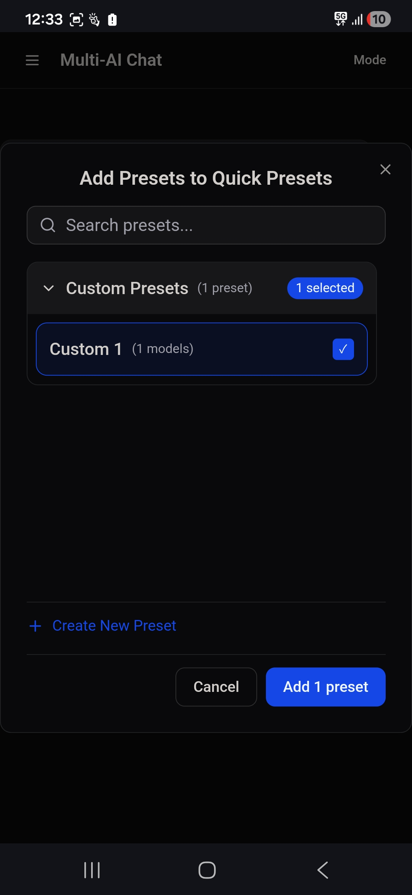

# Multi-AI Chat - Reference Version Documentation

**Version:** 779958d3  
**Date:** December 22, 2025  
**Status:** Working / Stable

---

## Overview

This document serves as the Reference Version for the Multi-AI Chat application. Use this as a baseline for future development and troubleshooting.

---

## Quick Presets Feature

### Quick Presets Panel

The Quick Presets panel is accessible via the "Presets" button in the chat footer. It displays a list of user's favorite presets for quick access.

**Key Features:**
- Drag-and-drop reordering (grip handle on left)
- Inline editing (double-click preset name or click pencil icon)
- Remove button (trash icon) to remove presets from Quick Presets
- "+ New" button opens the Add Presets modal dialog

**UI Elements:**
- Header: "Quick Presets" title with "+ New" button on right
- Preset items: Drag handle | Preset button (name + model count badge) | Edit button | Delete button
- Model count displayed in blue pill badge

### Add Presets Modal Dialog ("+ New" Button)

When clicking "+ New", a modal dialog opens with the following features:

**Modal Structure:**
1. **Header:** "Add Presets to Quick Presets" with close (X) button
2. **Search Input:** Search bar with magnifying glass icon, placeholder "Search presets..."
3. **Preset Categories:** Collapsible sections organized by type
4. **Create New Preset:** Link at bottom with plus icon
5. **Action Buttons:** "Cancel" and "Add X preset(s)" buttons

**Categories:**
- **Coding** - Contains coding-related presets (Coding Team)
- **Writing** - Contains writing-related presets (Creative Writers)
- **Research** - Contains research-related presets (Research Squad)
- **General** - Contains general-purpose presets (General Purpose, Fast Responders)
- **Custom Presets** - User-created custom presets

**Category Behavior:**
- Each category shows preset count: "(X preset)" or "(X presets)"
- Clicking category header expands/collapses the section
- Chevron icon indicates expanded (down) or collapsed (right) state
- Selected count badge appears when presets are selected: "X selected"

**Preset Selection:**
- Click preset to toggle selection
- Selected presets show checkmark (✓) and highlighted border
- Multiple presets can be selected across categories
- "Add X preset(s)" button appears when presets are selected

**Search Functionality:**
- Filters presets by name or model names
- Updates in real-time as user types
- Shows "No presets match your search" when no results
- Shows "All presets are already in Quick Presets" when all added

---

## File Structure

### Key Components

```
client/src/components/
├── FloatingChatWindow.tsx    # Main chat window with Quick Presets panel
├── PresetSelectionDialog.tsx # Add Presets modal dialog
├── PresetsPanel.tsx          # Standalone presets panel component
├── PresetEditorModal.tsx     # Create/edit preset modal
└── PresetsManagementModal.tsx # Full presets management
```

### State Management

**Quick Presets State (FloatingChatWindow.tsx):**
```typescript
const [quickPresets, setQuickPresets] = useState<QuickPreset[]>([]);
const [showPresetSelection, setShowPresetSelection] = useState(false);
```

**QuickPreset Type (lib/quick-presets.ts):**
```typescript
interface QuickPreset {
  id: string;
  sourceId: string;
  sourceType: 'built-in' | 'custom';
  name: string;
  models: string[];
  isModified?: boolean;
}
```

---

## Built-in Presets

Defined in `client/src/lib/ai-providers.ts`:

| Preset Key | Name | Models |
|------------|------|--------|
| coding | Coding Team | GPT-4o, DeepSeek Coder, Codestral |
| creative | Creative Writers | Claude 3.5 Sonnet, GPT-4o, Gemini 1.5 Pro |
| research | Research Squad | Perplexity, Claude 3.5 Sonnet, GPT-4o |
| general | General Purpose | GPT-4o, Claude 3.5 Sonnet, Gemini 1.5 Pro |
| fast | Fast Responders | GPT-4o Mini, Claude 3 Haiku, Gemini 1.5 Flash |

---

## localStorage Keys

| Key | Description |
|-----|-------------|
| `quickPresets` | Array of QuickPreset objects |
| `customPresets` | Array of user-created custom presets |

---

## Troubleshooting Guide

### Modal Not Opening
1. Check if `showPresetSelection` state is being set to `true`
2. Verify PresetSelectionDialog is rendered in component tree
3. Check for JavaScript errors in console

### Presets Not Showing in Categories
1. Verify `MODEL_PRESETS` is imported correctly
2. Check `PRESET_CATEGORIES` mapping in PresetSelectionDialog.tsx
3. Ensure presets aren't already in `quickPresets` (they get filtered out)

### Search Not Working
1. Check `searchQuery` state is updating
2. Verify `filteredPresets` useMemo dependency array
3. Ensure search matches preset name or model names

### Create New Preset Not Working
1. Verify `onCreateNew` prop is passed to PresetSelectionDialog
2. Check if PresetEditorModal is rendered
3. Ensure `showPresetEditor` state is being set

---

## Screenshots Reference

### Quick Presets Panel


**Key Elements:**
- Shows list of presets with drag handles (6 dots on left)
- Each preset has: grip icon, name button with model count badge, edit (pencil) icon, delete (trash) icon
- "+ New" button in top right corner
- Presets shown: Coding Team, Creative Writers, Research Squad, General Purpose, Fast Responders, Custom 1

### Add Presets Modal


**Key Elements:**
- Modal title: "Add Presets to Quick Presets" with X close button
- Search input with magnifying glass icon
- Collapsible "Custom Presets" category showing "(1 preset)" and "1 selected" badge
- "Custom 1 (1 models)" preset with blue checkmark indicating selection
- "+ Create New Preset" link at bottom in blue
- "Cancel" button (outline) and "Add 1 preset" button (filled blue)

---

## Version History

| Version | Date | Changes |
|---------|------|---------|
| 779958d3 | Dec 22, 2025 | Implemented modal dialog with search, categories, and create new preset |

---

*This document should be updated whenever significant changes are made to the Quick Presets feature.*
